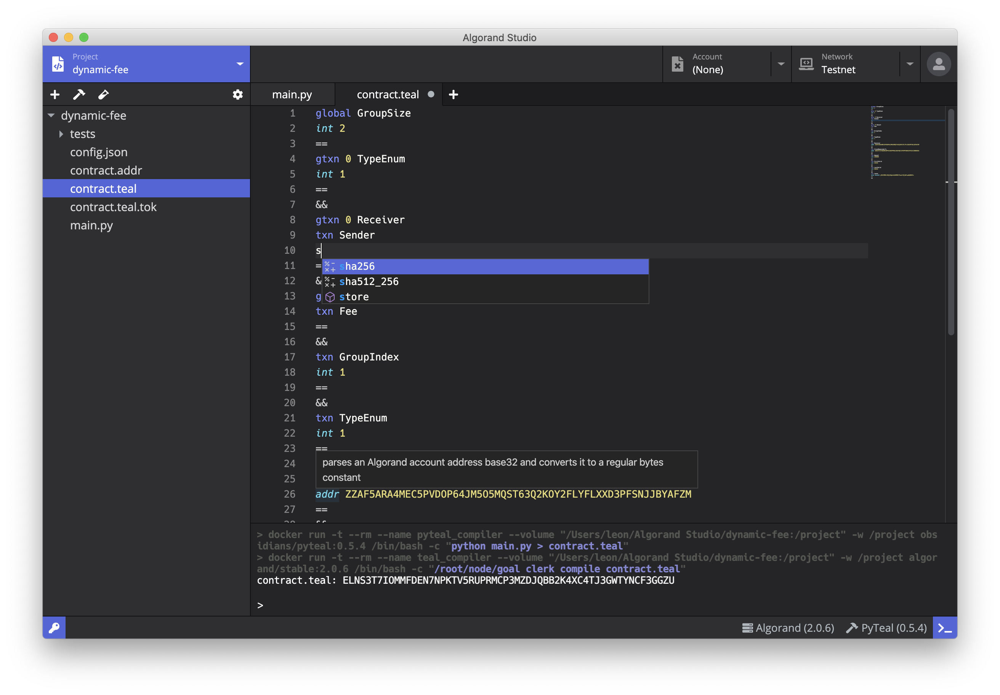
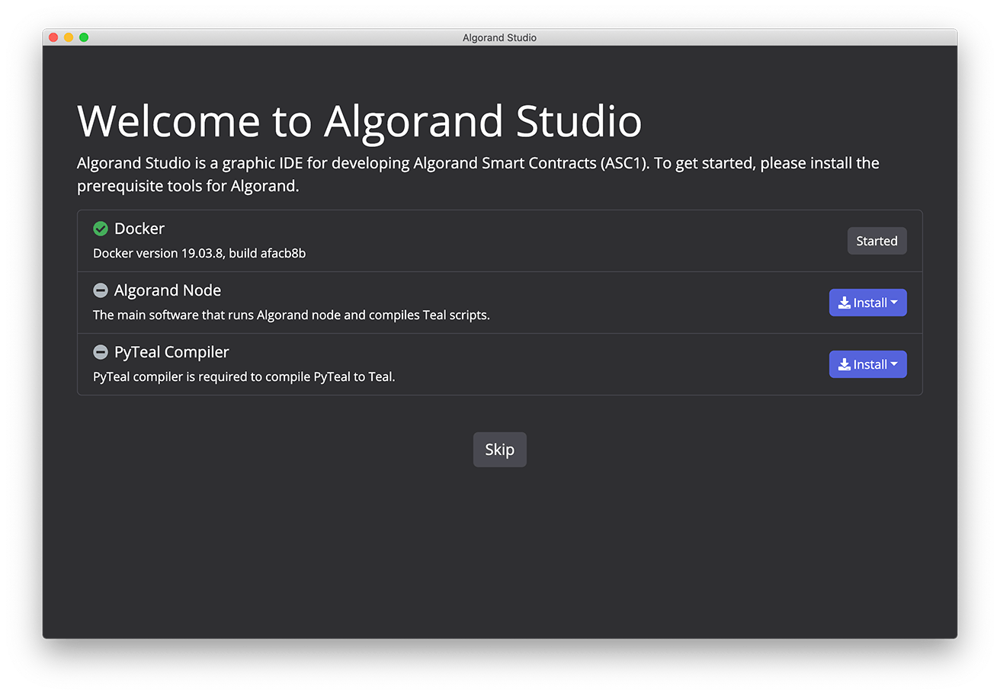
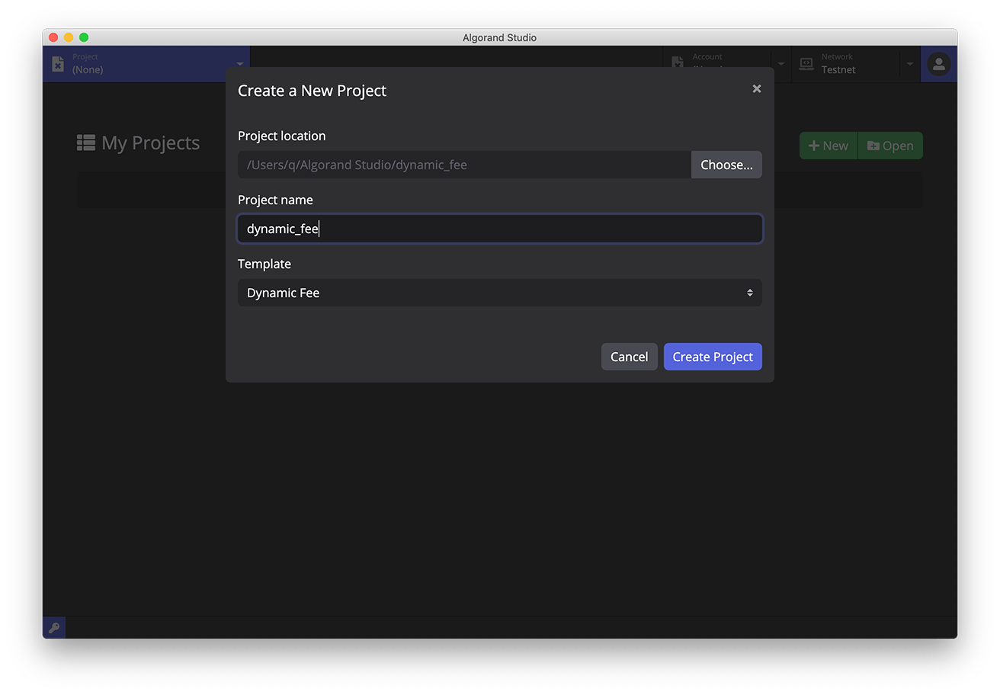
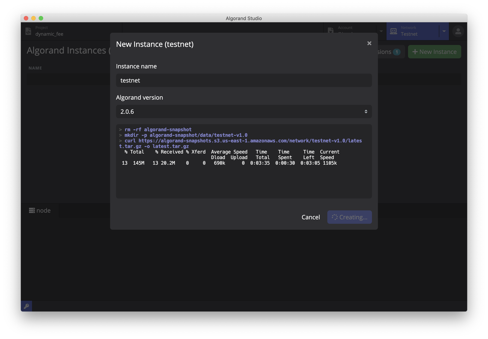
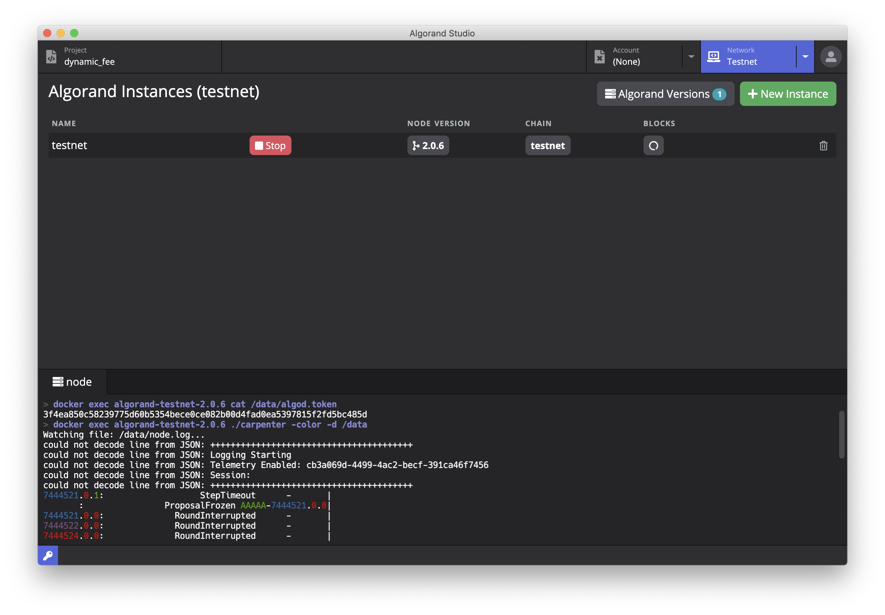
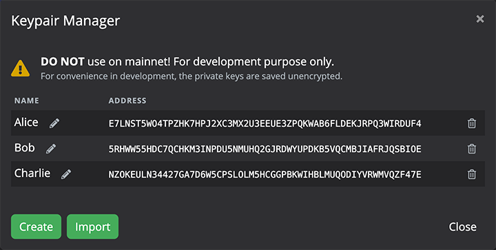
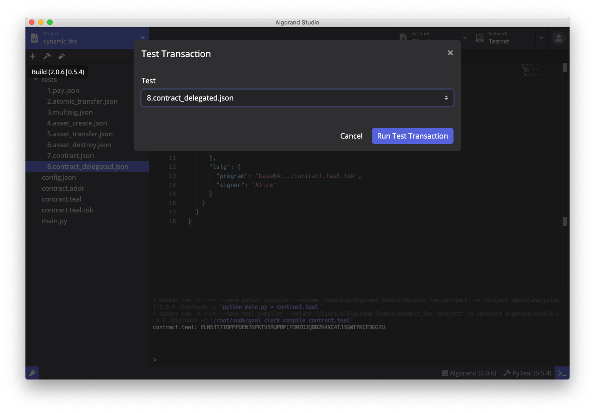
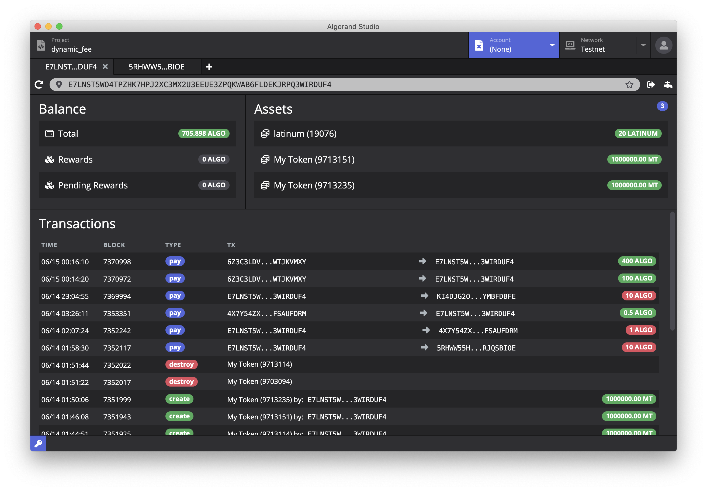

# Algorand Studio

Algorand Studio is an IDE to develop [Algorand Smart Contracts (ASC1)](https://developer.algorand.org/docs/features/asc1/) for the [Algorand Blockchain](https://www.algorand.com/). It includes [TEAL](https://developer.algorand.org/docs/reference/teal/specification/) code editor and compiler, [PyTeal](https://github.com/algorand/pyteal) integration, Algorand node, keypair manager, and block explorer. The IDE can also help to construct Algorand transactions, include [atomic transfers](https://developer.algorand.org/docs/features/atomic_transfers/), multi-sig transactions, [Algorand Standard Assets (ASA)](https://developer.algorand.org/docs/features/asa/) creation/transfer/destory, and [direct](https://developer.algorand.org/docs/features/asc1/modes/#contract-account) and [delegated](https://developer.algorand.org/docs/features/asc1/modes/#delegated-approval) contract executions.



## Installation

### Download

Installation packages are provided in [releases](https://github.com/ObsidianLabs/AlgorandStudio/releases). Please select the appropriate format according to your operating system (`.dmg` or `.zip` for Mac OS, `.AppImage` for Linux).

### Install

- **MacOS**: Double-click to open `AlgorandStudio-x.x.x.dmg` and drag `Algorand Studio` into the `Applications` folder.
- **Linux** Right-click `AlgorandStudio-x.x.x.AppImage`, select `Properties` => `Permissions` => `Execute`, and check the option `Allow executing file as progrom`. Close the property window and double-click the application to open it.
(Different Linux systems may have slightly different installation procedures)

## Feature Walkthrough

### Prerequisites

When Algorand Studio is properly installed and started for the first time, it will display a welcome page to help you install the dependencies for ASC1 development - Docker, Algorand node, and PyTeal.

<p align="center">
  
</p>

- Algorand Studio will use [**Docker**](https://www.docker.com/) to run Algorand node and the compiler. If you don't have Docker installed before, click the `Install Docker` button to open the Docker official website for download and installation.
- [**Algorand Node**](https://hub.docker.com/r/algorand/stable) is the official docker image for pre-built Algorand executables. Algorand Studio will use this image to run algorand nodes and compile TEAL scripts.  Click the `Install` button, select the latest version, and a popup window will show up to download the docker image.
- [**PyTeal**](https://hub.docker.com/r/obsidians/pyteal) is a pre-built docker image with python and the [pyteal](https://github.com/algorand/pyteal) library. It is required to compile a PyTeal project. Click the `Install` button again to install it.

After all dependencies are installed, the gray `Skip` button will change to `Get Started`. You can click it and enter the main interface of Algorand Studio.

### Create a Project

The main interface will show a list of Algorand projects. If you open Algorand Studio for the first time, this list will be empty. Click the `New` button to create a new project. You can select from a list of templates to generate initial files. Created projects will be placed in the workspace folder `$HOME/Algorand Studio`.

<p align="center">
  
</p>

After a project is created, Algorand Studio will automatically navigate to the project editor.

### Compile the ASC1

Click the `Build` button (with the hammer icon) in the project toolbar (above the file tree) to compile the Algorand smart contract. If this is a pure TEAL project, it only requires the Algorand node docker image to compile TEAL scripts to binaries. If this is a PyTeal project, it also requires the PyTeal docker image to compile PyTeal to TEAL in advance.

<p align="center">
  
</p>

The terminal below will display logs and errors from the compiler. If the smart contract is compiled successfully, the terminal will print the [contract address](https://developer.algorand.org/docs/features/asc1/goal_teal_walkthrough/#simple-teal-example) and save it to the file `./contract.addr` for later use.

### Start an Algorand Node

Click the `Network` tab in the header and switch to the Algorand network manager. It only supports TestNet now and we will provide BetaNet & MainNet in the future.

When you use Algorand Studio to run an Algorand node for the first time, you need to create a node instance. Click the `New Instance` button in the upper right corner and enter a name to create a new node instance. Algorand Studio will download the latest snapshot for the using network so network data will be up-to-date.

<p align="center">
  
</p>

Once the node instance is created, you can click the `Start` button to start the Algorand node. Algorand Studio will automatically detect the network token (printed in the log terminal) so other components of Algorand Studio can connect to the network. Therefore, you will be able to query network data and push transactions to it. The real-time logs for the running node will also be displayed in the terminal.

<p align="center">
  
</p>

### Keypair Manager

On any interface of Algorand Studio, you can click the green key button on the left of the bottom bar to open the Algorand keypair manager.

<p align="center">
  
</p>

In the keypair manager, you can create, import and manager Algorand keypairs. The manager will export a signature provider for other components of Algorand Studio to sign transactions, including regular signing, multi-sig signing and signing for a LogicSig. You can also give each keypair a name so that you can easily specify the sender, recipient and signers when using a [template](#transaction-template) to construct a transaction.

### Transaction Template

In order to facilitate the construction of various Algorand transactions, we propose a protocol to construct transactions based on JSON templates. A sample transaction template is shown below

``` js
{
  "name": "Sample Transaction",
  "accounts": [
    {
      "name": "MultiSig",
      "msig": {
        "version": 1,
        "threshold": 2,
        "addrs": ["Alice", "Bob", "Charlie"] // Alice, Bob & Charlie need to be defined in the keypair manager
      }
    }
  ],
  "txns": [
    {
      "type": "pay",
      "params": {
        "from": "MultiSig",
        "to": "Alice",
        "amount": 10
      },
      "signers": ["Alice", "Bob"]
    }, {
      "type": "pay",
      "params": {
        "from": "Alice",
        "to": "Bob",
        "amount": 10
      },
      "signers": ["Alice"] // Must has Alice in the keypair manager
    }
  ]
}
```

The `accounts` field is an array where you can define addresses (including multi-sig addresses) involved in the transaction. Accounts in the [keypair manager](#keypair-manager) will automatically be injected in this array before the template is sent for execution. You can use names defined in the keypair manager to refer to their addresses. Notice that if an account is used as a signer, it must be associated with a keypair in the keypair manager so that the transaction can be signed correctly.

The `txns` field is designed to be an array so that constructing an atomic transfer can be done by simply combining multiple individual transaction objects.

The `type` for an individual transaction can be `pay`, `asset-create`, `asset-opt-in`, `asset-transfer`, or `asset-destroy`. Other transaction types will be supported in the future. You can find sample transaction templates in the project folder `./tests` to see how to use them. Other configuration fields are quite self-explanatory.

### Send a Test Transaction

To send a test transaction, click the third button (with the test tube icon) in the toolbar to open the *Test Transaction* modal. You will be able to select from a list of transactions defined in the `./tests` folder. This feature can also be used to test smart contract executions. For example, templates `tests/7.contract.json` and `tests/8.contract_delegated.json` have defined two transactions that execute the compiled smart contract, one as a [contract address](https://developer.algorand.org/docs/features/asc1/modes/#contract-account) and another as [delegated approval](https://developer.algorand.org/docs/features/asc1/modes/#delegated-approval).

<p align="center">
  
</p>

### Algorand Explorer

Algorand Studio also comes with a simple block explorer so that you can lookup basic account information, such as ALGO balance, ASA balance and transaction history. For more advanced usage, please go to [AlgoExplorer](https://testnet.algoexplorer.io/) or [GoalSeeker](https://goalseeker.purestake.io/algorand/testnet).

<p align="center">
  
</p>

To the right of the address bar, there are also some buttons for convenient tools. We currently provide a faucet tool for claiming free TestNet tokens, and a transfer tool for constructing ALGO transfer and ASA transfer transactions.

